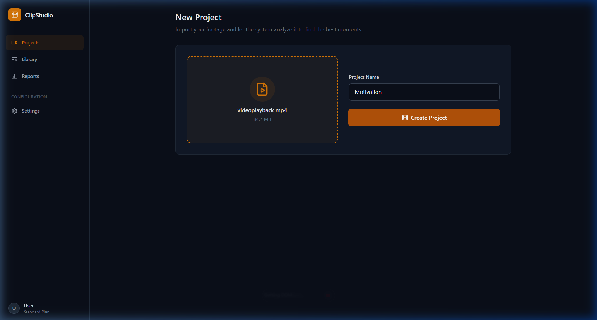
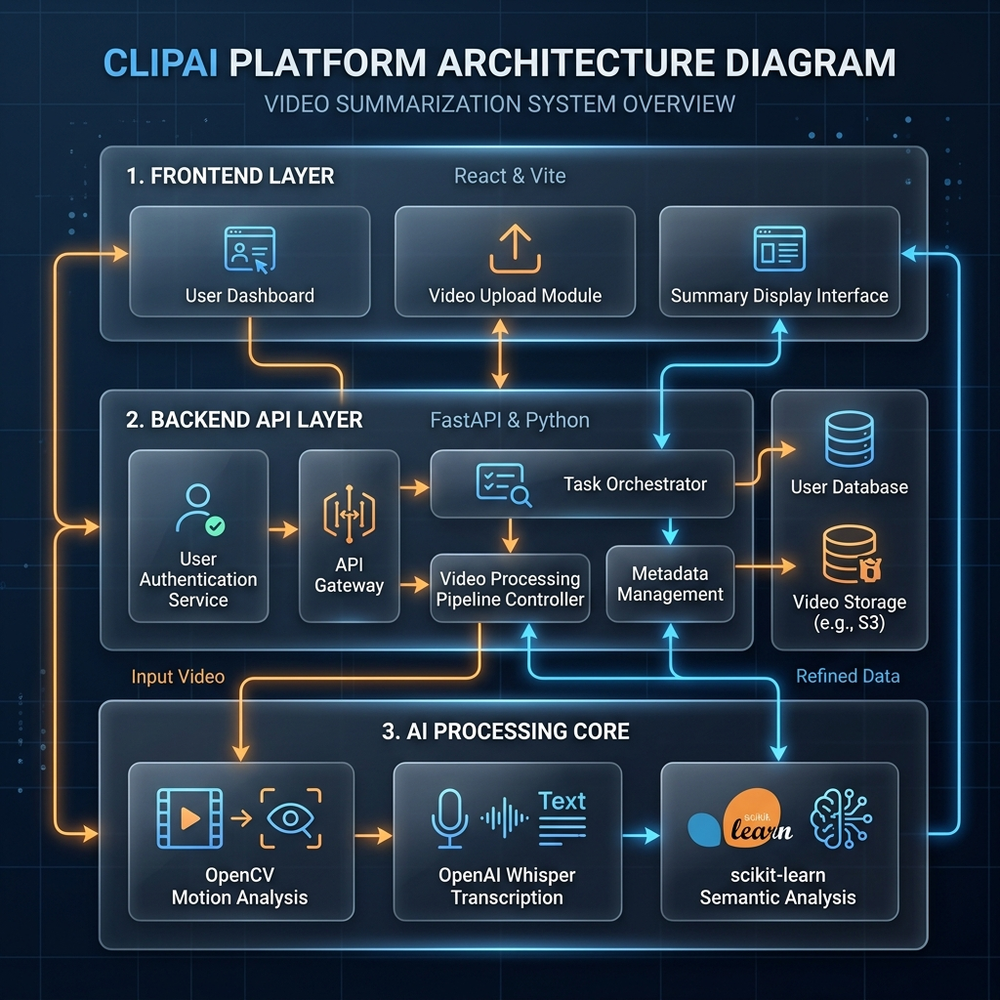

# Automated Video Editing and Highlight Generation

An intelligent system designed to automate the process of video editing and highlight extraction using advanced AI techniques.

## 🚀 Overview

This project provides an end-to-end pipeline for processing videos, generating highlights, and providing an interactive dashboard for management and analytics.

### Key Features
- **Automated Highlight Detection**: Uses AI to identify key moments in videos.
- **Video Processing Pipeline**: Scalable backend for video transformation and analysis.
- **Modern Dashboard**: A premium UI for managing video projects and viewing analytics.
- **Clinical/Technical Integration**: Designed for high-accuracy processing.

---

## 📸 Screenshots

### Dashboard Overview


### System Architecture


---

## 🛠️ Requirements

### Backend (Python)
The backend is built with Python and requires several dependencies for video processing and AI integration.
- Python 3.8+
- [requirements.txt](video-back/requirements.txt)
  ```bash
  cd video-back
  pip install -r requirements.txt
  ```

### Frontend (Vite + React)
The frontend is a modern web application built with React and Vite.
- Node.js 16+
- [package.json](video-front/package.json)
  ```bash
  cd video-front
  npm install
  npm run dev
  ```

---

## 📂 Project Structure

- `video-back/`: Flask/FastAPI based backend for video processing.
- `video-front/`: React frontend for the user interface.
- `images/`: Project screenshots and architecture diagrams.
- `TECHNICAL_ARCHITECTURE.md`: Detailed technical documentation.

---

## 🚦 Getting Started

1. Clone the repository:
   ```bash
   git clone https://github.com/IrfanM-7/Video-Proj.git
   ```
2. Set up the backend:
   ```bash
   cd video-back
   # Configure your environment variables
   python main.py
   ```
3. Set up the frontend:
   ```bash
   cd video-front
   npm install
   npm run dev
   ```

---

## 👨‍💻 Contributors
- **Syed Irfan M**

---
© 2026 Automated Video Editing Project. All Rights Reserved.
